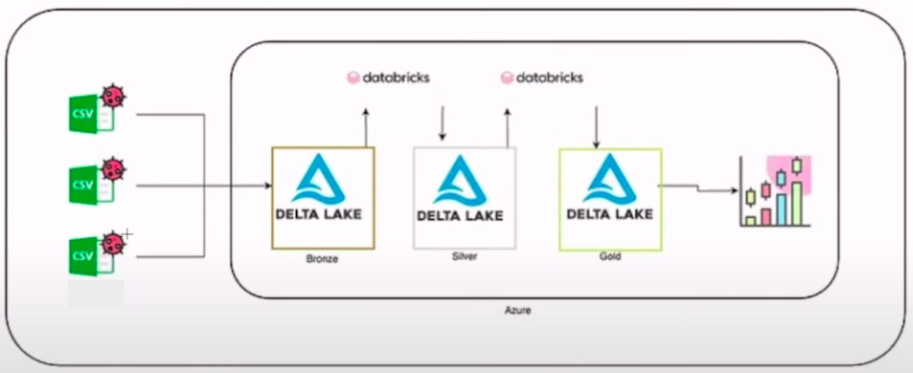

# WebScraping_Python_bmg
Webscraping com Python em múltiplas páginas para ingestão de produtos em banco de dados, implementando Requests  para fazer a requisição na URL e Beautifulsoup para buscar e construir a lista de produtos dentro de um site dinâmico aplicando a linguagem REGEX para limpeza dos dados..

